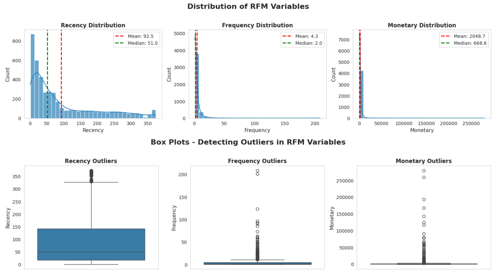
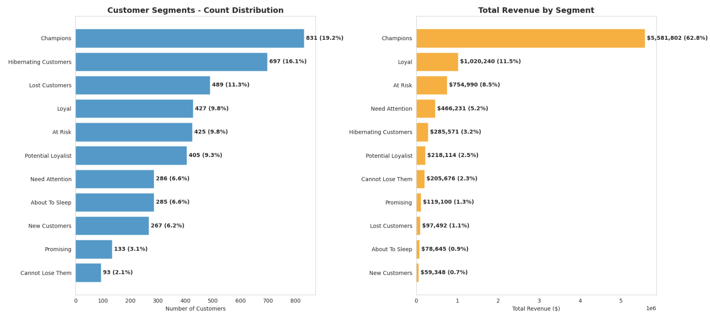
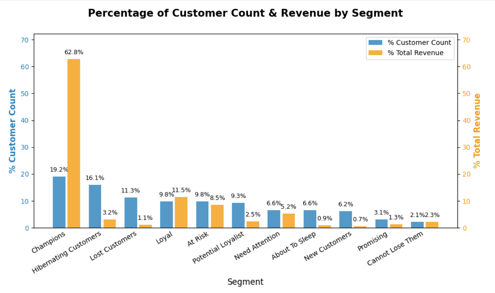
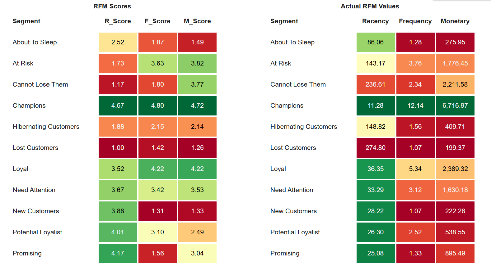

# RFM Customer Segmentation for Holiday Campaigns in Global Retail | Python

Author: [LUU MY HOA]  
Date: April 2026  
Tools Used: Python  

## 📑 Table of Contents  
1. [Background & Overview](#1-background--overview) 
2. [Dataset Description & Data Structure](#2-dataset-description--data-structure)
3. [Data Cleaning & Preprocessing](#3-data-cleaning--preprocessing)
4. [Apply RFM Model](#4-apply-rfm-model)
5. [Visualization & Analysis](#5-visualization--analysis)
6. [Final Conclusion & Recommendations](#6-final-conclusion--recommendations)

## 1. Background & Overview  

This project focuses on customer segmentation for a global company (SuperStore) to support customer appreciation during the Christmas and New Year period. In addition, the segmentation is designed not only for this campaign but also to support long-term customer management strategies.

### 📌 Business Context:
- SuperStore is a UK-based online retail company
- The company mainly sells unique all-occasion gifts, with many customers being wholesalers
- During the Christmas and New Year season, the Marketing team plans to run a “Thank You” campaign to appreciate customers who have supported the company over time
- The Marketing team requested support from the Data Analytics team to segment customers

### ❓ Main Business Questions:
- How are customers distributed across different RFM segments?
- Which segments should be prioritized for the holiday “Thank You” campaign?
- Where are the growth opportunities in the customer lifecycle?
  
### 👤 Who is this project for?
- Marketing Teams: Design targeted campaigns for different customer groups
- Data & Business Analysts: Learn how to build an automated segmentation using Python
- Decision-makers: Understand customer behavior and support long-term strategy

### 📊 Why RFM?
RFM (Recency, Frequency, Monetary) is a simple and effective method to segment customers based on their purchasing behavior:
- Recency (R): How recently a customer made a purchase
- Frequency (F): How often a customer makes purchases
- Monetary (M): How much a customer spends

## 2. Dataset Description & Data Structure  

### 📂 Data Source  
- Source: Online Retail dataset (SuperStore)
- Format: .xlsx
- Content: 2 sheets (transactional data, segmentation)
- Size:  541,910 rows × 8 columns (sheet 1), 12 rows x 2 columns (sheet 2)

### 📌 Data Structure 
Sheet 1 : The dataset consists of transactional records, where each row represents a product a product within an invoice.

<details> <summary> The table schema </summary>
  
| Column Name | Description |
| :--------- | :------------|
| InvoiceNo | Invoice number. If it starts with “C”, it indicates a cancellation |
| StockCode | Product code |
| Description | Product name |
| Quantity | Number of items purchased per transaction |
| InvoiceDate | Date and time when the transaction was created |
| UnitPrice | Price per unit (in GBP) |
| CustomerID| Customer identifier |
| Country | Country where the customer is located |
</details>
  
Sheet 2: Segmentation mapping defines business rules for mapping RFM scores to customer segments. Each RFM score is a 3-digit combination representing a combination of Recency (R), Frequency (F), and Monetary (M), where each dimension is scored from 1 to 5.
<details> <summary>Full table</summary>
  
| Segment   | RFM Score      |
| :--- | :--- |
| Champions            | 555, 554, 544, 545, 454, 455, 445 |
| Loyal                 | 543, 444, 435, 355, 354, 345, 344, 335 |
| Potential Loyalist    | 553, 551, 552, 541, 542, 533, 532, 531, 452, 451, 442, 441, 431, 453, 433, 432, 423, 353, 352, 351, 342, 341, 333, 323 |
| New Customers        | 512, 511, 422, 421, 412, 411, 311   |
| Promising             | 525, 524, 523, 522, 521, 515, 514, 513, 425, 424, 413, 414, 415, 315, 314, 313 |
| Need Attention       | 535, 534, 443, 434, 343, 334, 325, 324 |
| About To Sleep       | 331, 321, 312, 221, 213, 231, 241, 251 |
| At Risk            | 255, 254, 245, 244, 253, 252, 243, 242, 235, 234, 225, 224, 153, 152, 145, 143, 142, 135, 134, 133, 125, 124           |
| Cannot Lose Them  | 155, 154, 144, 214, 215, 115, 114, 113       |
| Hibernating Customers| 332, 322, 233, 232, 223, 222, 132, 123, 122, 212, 211   |
| Lost Customers| 111, 112, 121, 131, 141, 151  |

</details>

### 🔗 Relationship Between Tables  

- RFM metrics are calculated from transactional data (Sheet 1)  
- The resulting RFM scores are mapped to segments (Sheet 2)  
- This mapping enables customer classification for targeted marketing strategies

## 3. Data Cleaning & Preprocessing

| Problem | Data Cleaning & Preprocessing |
|:--------|:-----------------------------|
| Duplicate records | Remove exact duplicate rows to avoid double-counting |
| InvoiceNo starts with 'C' | Remove canceled transactions (not actual purchases) |
| Quantity <= 0 | Removed to exclude returns and invalid transactions |
| UnitPrice <= 0 | Remove to ensure valid revenue calculation |
| Missing CustomerID | Remove, as RFM analysis requires customer-level identification |
| CustomerID data type | Convert to integer for consistency |
| Missing revenue metric | Create Revenue = Quantity × UnitPrice |
| Undefined date range | Identify min/max InvoiceDate to define analysis period |

```python
df_clean = df.copy()

# Remove duplicates
df_clean = df_clean.drop_duplicates()

# Remove canceled invoices
df_clean = df_clean[~df_clean['InvoiceNo'].astype(str).str.startswith('C')]

# Filter valid transactions
df_clean = df_clean[(df_clean['Quantity'] > 0) & (df_clean['UnitPrice'] > 0)]

# Remove missing customers
df_clean = df_clean[df_clean['CustomerID'].notna()]

# Convert data types
df_clean['CustomerID'] = df_clean['CustomerID'].astype(int)

# Create revenue
df_clean['Revenue'] = df_clean['Quantity'] * df_clean['UnitPrice']

print(f" Raw data: {df.shape[0]:,} rows × {df.shape[1]} columns")
print(f" After cleaning: {df_clean.shape[0]:,} rows ({df_clean.shape[0]/df.shape[0]*100:.1f}% retained)")
print(f" Unique customers: {df_clean['CustomerID'].nunique():,}")
print(f" Date range: {df_clean['InvoiceDate'].min().date()} → {df_clean['InvoiceDate'].max().date()}")
```

### 📊 Data Summary

Raw data: 541,909 rows × 8 columns

After cleaning: 392,692 rows (72.5% retained)

Unique customers: 4,338
   
Date range: 2010-12-01 → 2011-12-09
   
## 4. Apply RFM Model
### 📌 RFM Calculation Logic
- **REFERENCE_DATE** is automatically defined as **1 day after the latest transaction date** to ensure Recency ≥ 1
- **Recency (R)** is calculated as the number of days since the customer's last purchase relative to the REFERENCE_DATE. A smaller Recency value indicates a more recent and active customer
- **Frequency (F)** is defined as the number of unique invoices (transactions) per customer
- **Monetary (M)** represents total revenue per customer (in GBP)

```python
# Identify the most recent date in your data
latest_date = df_clean['InvoiceDate'].max()

# Set reference date (1 day after the latest transaction)
REFERENCE_DATE = latest_date + dt.timedelta(days=1)

# Cal R, F, M
rfm = df_clean.groupby('CustomerID').agg(
    Recency   = ('InvoiceDate', lambda x: (REFERENCE_DATE - x.max()).days),
    Frequency = ('InvoiceNo',   'nunique'),
    Monetary  = ('Revenue',     'sum')
).reset_index()

print(f"📊 RFM Summary:")
print(rfm[['Recency','Frequency','Monetary']].describe().round(2).to_string())
```
### 📊 RFM Summary

|  | Recency | Frequency | Monetary |
|---|---|---|---|
| count | 4,338.00 | 4,338.00 | 4,338.00 |
| mean | 92.54 | 4.27 | 2,048.69 |
| std | 100.01 | 7.70 | 8,985.23 |
| min | 1.00 | 1.00 | 3.75 |
| 25% | 18.00 | 1.00 | 306.48 |
| 50% | 51.00 | 2.00 | 668.57 |
| 75% | 142.00 | 5.00 | 1,660.60 |
| max | 374.00 | 209.00 | 280,206.02 |

*The summary statistics provide an overview of customer behavior distribution before segmentation.*

### RFM SCORING — Quintile (scale 1–5) 
- Each metric is divided into 5 equal-sized groups using quintiles (qcut). This ensures a balanced distribution of customers across score levels
- Recency is reversed (lower is better), while Frequency and Monetary are positively scored  
- Ranking is applied before qcut to handle duplicate values and ensure stable binning
  
```python 
# Recency: smaller = more recent = BETTER → reverse labels
rfm['R_Score'] = pd.qcut(rfm['Recency'].rank(method='first'), 5, labels=[5,4,3,2,1]).astype(int)

# Frequency & Monetary: larger = better → ascending labels
rfm['F_Score'] = pd.qcut(rfm['Frequency'].rank(method='first'), 5, labels=[1,2,3,4,5]).astype(int)
rfm['M_Score'] = pd.qcut(rfm['Monetary'].rank(method='first'), 5, labels=[1,2,3,4,5]).astype(int)

rfm['RFM_Score'] = rfm['R_Score'].astype(str) + rfm['F_Score'].astype(str) + rfm['M_Score'].astype(str)
```

### SEGMENT DICTIONARY
- The SEGMENT DICTIONARY defines customer segments based on the business rules provided in Sheet 2 of the dataset.

<details> <summary>Code Python</summary>
  
```python 
segment_dict = {
    'Champions': {'555','554','544','545','454','455','445'},
    'Loyal': {'543','444','435','355','354','345','344','335'},
    'Potential Loyalist': {'553','551','552','541','542','533','532','531','452','451','442',
                           '441','431','453','433','432','423','353','352','351','342','341','333','323'},
    'New Customers': {'512','511','422','421','412','411','311'},
    'Promising': {'525','524','523','522','521','515','514','513','425','424','413','414','415','315','314','313'},
    'Need Attention': {'535','534','443','434','343','334','325','324'},
    'About To Sleep': {'331','321','312','221','213','231','241','251'},
    'At Risk': {'255','254','245','244','253','252','243','242','235','234','225','224','153',
                '152','145','143','142','135','134','133','125','124'},
    'Cannot Lose Them': {'155','154','144','214','215','115','114','113'},
    'Hibernating Customers': {'332','322','233','232','223','222','132','123','122','212','211'},
    'Lost Customers': {'111','112','121','131','141','151'}
}
```
</details>

### MAPPING RFM SCORE AND SEGMENT
  
```python 
# Hàm gán segment dựa theo bảng
def assign_segment(rfm_code):
    for segment, codes in segment_dict.items():
        if rfm_code in codes:
            return segment
    return 'Others'

# Áp dụng vào dataframe
rfm['Segment'] = rfm['RFM_Score'].apply(assign_segment)
```

<details> <summary>rfm</summary>
  
| | CustomerID | Recency | Frequency | Monetary | R_Score | F_Score | M_Score | RFM_Score | Segment |
|---|---|---|---|---|---|---|---|---|---|
| 0 | 12346 | 326 | 1 | 77183.60 | 1 | 1 | 5 | 115 | Cannot Lose Them |
| 1 | 12347 | 2 | 7 | 4310.00 | 5 | 5 | 5 | 555 | Champions |
| 2 | 12348 | 75 | 4 | 1797.24 | 2 | 4 | 4 | 244 | At Risk |
| 3 | 12349 | 19 | 1 | 1757.55 | 4 | 1 | 4 | 414 | Promising |
| 4 | 12350 | 310 | 1 | 334.40 | 1 | 1 | 2 | 112 | Lost Customers |
| ... | ... | ... | ... | ... | ... | ... | ... | ... | ... |
| 4333 | 18280 | 278 | 1 | 180.60 | 1 | 2 | 1 | 121 | Lost Customers |
| 4334 | 18281 | 181 | 1 | 80.82 | 1 | 2 | 1 | 121 | Lost Customers |
| 4335 | 18282 | 8 | 2 | 178.05 | 5 | 3 | 1 | 531 | Potential Loyalist |
| 4336 | 18283 | 4 | 16 | 2045.53 | 5 | 5 | 4 | 554 | Champions |
| 4337 | 18287 | 43 | 3 | 1837.28 | 3 | 4 | 4 | 344 | Loyal |

4338 rows × 9 columns
</details>

### 📊 Segment Distribution Summary

<details> <summary>Code Python</summary>
  
```python
seg_stats = (
    rfm.groupby('Segment')
    .agg(
        Cus       = ('CustomerID', 'count'),
        Avg_Recency = ('Recency',    'mean'),
        Avg_Freq    = ('Frequency',  'mean'),
        Avg_Mon     = ('Monetary',   'mean'),
        Total_Rev   = ('Monetary',   'sum'),
    )
    .reset_index()
    .sort_values('Cus', ascending=False)
    .reset_index(drop=True)
)

# %_Cus và %_Rev
seg_stats['%_Cus'] = (seg_stats['Cus'] / seg_stats['Cus'].sum()) * 100
seg_stats['%_Rev'] = (seg_stats['Total_Rev'] / seg_stats['Total_Rev'].sum()) * 100

cols = ['Segment','Cus','%_Cus','Avg_Recency','Avg_Freq','Avg_Mon','Total_Rev','%_Rev']
seg_stats = seg_stats[cols]

#Total
total_row = {
    'Segment': 'Total',
    'Cus': seg_stats['Cus'].sum(),
    '%_Cus': 100,
    'Avg_Recency': seg_stats['Avg_Recency'].mean(), 
    'Avg_Freq': seg_stats['Avg_Freq'].mean(),
    'Avg_Mon': seg_stats['Avg_Mon'].mean(),
    'Total_Rev': seg_stats['Total_Rev'].sum(),
    '%_Rev': 100
}

#concat total 
seg_stats_with_total = pd.concat([seg_stats, pd.DataFrame([total_row])], ignore_index=True)

print(f"Segment distribution: ")
print(seg_stats_with_total.round(2).to_string(index=False))
```

</details>

| Segment | Cus | %_Cus | Avg_Recency | Avg_Freq | Avg_Mon | Total_Rev | %_Rev |
|---|---|---|---|---|---|---|---|
| Champions | 831 | 19.16 | 11.28 | 12.14 | 6716.97 | 5581802.32 | 62.81 |
| Hibernating Customers | 697 | 16.07 | 148.82 | 1.56 | 409.71 | 285570.76 | 3.21 |
| Lost Customers | 489 | 11.27 | 274.80 | 1.07 | 199.37 | 97491.54 | 1.10 |
| Loyal | 427 | 9.84 | 36.35 | 5.34 | 2389.32 | 1020240.32 | 11.48 |
| At Risk | 425 | 9.80 | 143.17 | 3.76 | 1776.45 | 754990.25 | 8.50 |
| Potential Loyalist | 405 | 9.34 | 26.30 | 2.52 | 538.55 | 218114.26 | 2.45 |
| Need Attention | 286 | 6.59 | 33.29 | 3.12 | 1630.18 | 466230.62 | 5.25 |
| About To Sleep | 285 | 6.57 | 86.06 | 1.28 | 275.95 | 78644.84 | 0.88 |
| New Customers | 267 | 6.15 | 28.22 | 1.07 | 222.28 | 59347.96 | 0.67 |
| Promising | 133 | 3.07 | 25.08 | 1.33 | 895.49 | 119099.52 | 1.34 |
| Cannot Lose Them | 93 | 2.14 | 236.61 | 2.34 | 2211.58 | 205676.50 | 2.31 |
| Total | 4338 | 100.00 | 95.45 | 3.23 | 1569.62 | 8887208.89 | 100.00 |


## 5. Visualization & Analysis
### 5.1 Distribution and Box Plots of RFM variables


**Distribution**

- Recency (R) is right-skewed: Median = 51 < Mean = 92 → Most customers purchased recently, but a large inactive group still exists
- Frequency (F) is highly skewed: Median = 2, Mean = 4.3 → Majority of customers purchase only 1–2 times
- Monetary (M) is extremely skewed: Median ≈ £669 vs Mean ≈ £2,048 → A few high-spending customers are significantly driving up the average

**Outlier Detection**

- Frequency outliers: customers with >200 transactions
- Monetary outliers: customers spending >£250K
→ These patterns strongly suggest the presence of wholesale / B2B customers

👉 Insight: Customer distribution is highly skewed by wholesale outliers (Monetary and Frequency) and year-end seasonality (Recency)
- Customer behavior is highly skewed across all RFM dimensions
- Extreme Monetary and Frequency outliers suggest a distinct B2B segment
- Recency distribution reflects strong seasonality (year-end concentration)
  
### 5.2 Customer Count Distribution and Revenue Contribution by Segment


- Largest segment: Champions (19.2%), contributes ~63% of total revenue
- Mid-tier segments (Loyal, At Risk) contribute meaningful revenue (~19.6%)
- Low-value segments (Hibernating, Lost) represent 27% of customers but contribute minimal revenue (~4%)

👉 Insight: Revenue is highly concentrated in a small group of customers, business follows a clear Pareto pattern. Customer value is extremely uneven → segmentation is critical for resource allocation

### 5. RFM Scores and Actual RFM Value by Segments 

- Champions: high across all RFM → core revenue drivers
- At Risk & Cannot Lose Them: high past value but declining recency
- Potential Loyalists: strong recency but low frequency → growth opportunity
  
👉 Insight: Different segments require distinct lifecycle strategies, not one-size-fits-all campaigns

## 6. Final Conclusion & Recommendations  

### OBJECTIVE 1: Holiday Customer Appreciation Campaign (Christmas & New Year)

| Priority                     | Segment                   | Strategy           |
|---|---|---|
| 🔴 High (Revenue Protection) | Champions                 | Invest heavily in premium gifts & VIP experience. Focus on retention and relationship strengthening |
| 🟡 Medium (Growth)           | Loyal, Potential Loyalist, Cannot Lose Them | Reinforce engagement and encourage repeat behavior |
| 🟢 Low (Cost Control)        | Hibernating, Lost         | Use low-cost automated re-engagement      |

### OBJECTIVE 2: Long-term Customer Strategy

**1.Segmentation-based Strategy (Current State)**

| Strategy | Target Segment | Key Actions | Business Goal |
|----------|---------------|------------|---------------|
| 🔴 Retention-first | Champions | Personalized engagement, VIP offers | Protect core revenue |
| 🟠 Reactivation | At Risk, Cannot Lose Them | Win-back campaigns, targeted offers | Recover value |
| 🟡 Growth pipeline | Potential Loyalists, Promising | Increase frequency, cross-sell | Drive future growth |
| 🟢 Cost optimization | Hibernating, Lost | Automation, low-cost campaigns | Improve efficiency |

While a unified RFM model is applied for campaign execution, customer behavior analysis indicates a clear distinction between wholesale (B2B) and retail (B2C) customers.

**2. Strategic Improvement & Hypothesis Testing**

While the above strategy provides a solid segmentation-based approach, it assumes a homogeneous customer base.

However, analysis shows a clear distinction between wholesale (B2B) and retail (B2C) customers.

- Recommendation: Future segmentation should separate B2B and B2C customers and apply RFM independently.

- Expected outcome: Improved segmentation accuracy, more effective targeting, and higher marketing ROI.
